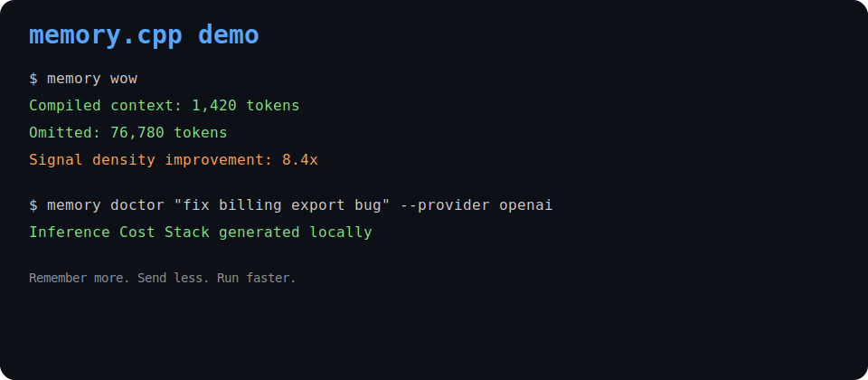
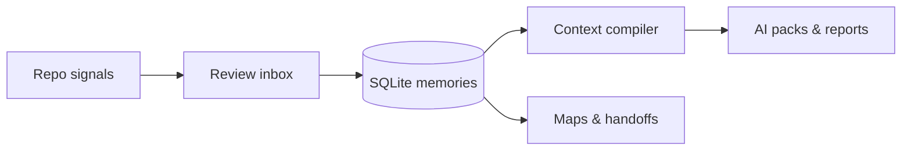

<div align="center">

# memory.cpp

**Your repo remembers. AI tools get less noise.**

Local-first context compiler · SQLite vault · Token firewall · MCP bridge

[](https://github.com/KirtiRamchandani/memory.cpp/actions/workflows/ci.yml)
[](https://github.com/KirtiRamchandani/memory.cpp/actions/workflows/release.yml)
[](LICENSE)

[Quick start](docs/quickstart.md) · [Install](docs/install.md) · [CLI](docs/cli.md) · [Website](website/index.html) · [Examples](examples/)

</div>

---

> **Remember more. Send less. Run faster.**

Stop paying models to reread the same repo context. `memory.cpp` compiles decisions, fixes, rules, and traces into **small verified packs** — with secrets blocked, stale memory excluded, and everything inspectable on disk.

<p align="center">
  
</p>

```text
Raw context available     84,000 tokens
Compiled context           1,420 tokens
Estimated waste blocked     82,580 token positions
Signal density               8.4×
```

---

## Install & run

```bash
./scripts/install.sh          # or: ./scripts/install.ps1
memory setup --developer --yes
memory wow
```

From source: `cargo build -p memory-cli && cargo run -p memory-cli -- wow`

---

## What it does

| Layer | Commands |
| --- | --- |
| **Daily dev** | `memory dev morning` · `dev resume` · `dev next` |
| **AI context** | `memory compile "fix bug" --budget 1500` · `context write --for cursor` |
| **Safety** | `memory token-firewall` · `memory doctor` · `memory warnings` |
| **Memory vault** | `memory remember` · `recall` · `ask` · `inbox review` |
| **Maps & share** | `memory map --output html` · `pr summary` · `handoff new-dev` |
| **Tooling** | `memory attach cursor --dry-run` · `agents-score` · `dashboard --html` |

<details>
<summary><strong>Full command reference</strong></summary>

See the complete table in [docs/cli.md](docs/cli.md) — 80+ commands for compile, cache planning, trace compression, entity memory, flight recorder, MCP hardening, and more.

</details>

---

## Why developers use it

**Local-first** — SQLite under `.memory.cpp/`. No cloud account required.  
**Context compiler** — Picks high-signal memory, drops duplicate & stale context.  
**Token firewall** — Redacts secrets, quarantines injection patterns before prompts.  
**Provider packs** — Cursor, Claude, Gemini, Continue, MCP — one repo, many outputs.  
**Evidence-backed** — Every pack cites memory IDs you can inspect and edit.  

Not a hosted SaaS. Not a vector DB you have to operate. A **control plane for AI context** that stays on your machine.

---

## 60-second demo

```bash
memory wow
memory compile "fix billing export bug" --provider openai --budget 1500
memory doctor "fix billing export bug" --provider openai
memory agents-score
```

Artifacts land in `.memory.cpp/reports/` — Markdown packs, doctor JSON, HTML dashboard. Deterministic transcript: `./scripts/demo-terminal.sh`

---

## Mental model



Git · docs · terminal · CI · notes → reviewed memory → smaller, safer prompts.

---

## Docs & examples

| Start here | Deep dives |
| --- | --- |
| [Quickstart](docs/quickstart.md) | [Context compiler](docs/context-compiler.md) |
| [First five minutes](docs/first-five-minutes.md) | [Inference bottlenecks](docs/inference-bottlenecks.md) |
| [Developer workflow](docs/dev-workflow.md) | [Safety & privacy](docs/safety.md) |
| [AI context packs](docs/context-packs.md) | [Competitive positioning](docs/competitive-positioning.md) |

Static examples: [token firewall](examples/token-firewall.md) · [project map](examples/project-map.html) · [PR comment](examples/pr-comment.md)

---

## Develop & validate

```bash
cargo test --workspace
./scripts/release-candidate.ps1    # fmt · clippy · test · docs checks
```

CI runs on **Linux, macOS, and Windows**. Release binaries ship with checksums.

---

## Privacy

Read-only MCP by default. Terminal capture is opt-in. Candidate memories need approval. See [SECURITY.md](SECURITY.md) · [privacy](docs/privacy.md).

---

<div align="center">

MIT © [KirtiRamchandani](https://github.com/KirtiRamchandani)

**Star the repo if your AI tools should stop rereading the same context.**

</div>
