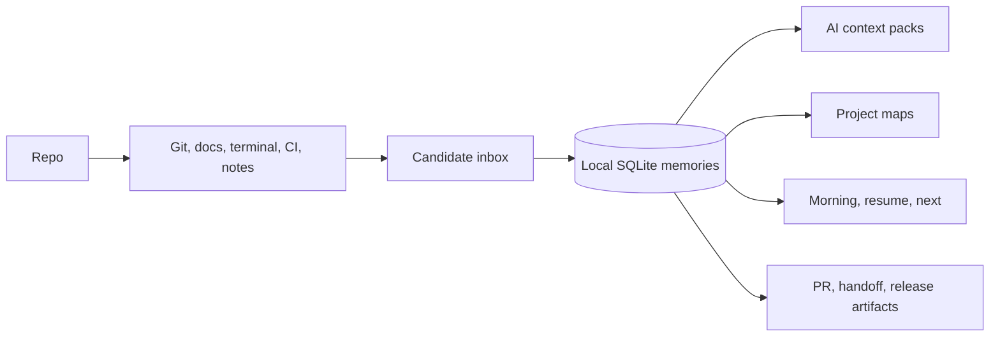

# memory.cpp


[Quick start](docs/quickstart.md) / [Install](docs/install.md) / [CLI](docs/cli.md) / [AI context](docs/context-packs.md) / [Maps](docs/maps.md) / [Safety](docs/safety.md) / [Roadmap](docs/roadmap.md)

**Your repo remembers.**

`memory.cpp` helps your repo remember what happened, why it changed, what broke, how it was fixed, what to do next, and what AI coding tools should know - locally, safely, and simply.

## Hot topics

- **Public developer adoption release:** daily briefs, AI context packs, project maps, PR summaries, handoff bundles, and shareable Markdown/HTML artifacts.
- **Single-page product site:** open [website/index.html](website/index.html) for the aligned website hub with links to docs, examples, recipes, launch assets, and workflows.
- **Local-first trust model:** SQLite storage under `.memory.cpp/`, read-only MCP by default, candidate review before uncertain memory, and no cloud account required.
- **CI hardening:** Linux, macOS, and Windows run format, Clippy, tests, and smoke checks. Release builds generate checksums.
- **Honest maturity:** core memory is stable; git/dev/map/inbox flows are beta; terminal, CI, dashboard, and FastEmbed/ONNX intent remain experimental.

---

## Quick start

Install or preview the installer:

```bash
./scripts/install.sh --dry-run
./scripts/install.sh
```

PowerShell:

```powershell
./scripts/install.ps1 -DryRun
./scripts/install.ps1
```

Start a repo memory workspace:

```bash
memory setup --developer --yes
memory dev morning
memory context write --for cursor --output .memory.cpp/context/cursor.md
memory map --type evolution --output html --save .memory.cpp/maps/evolution.html
memory doctor
```

If you are working from source:

```bash
cargo build -p memory-cli
cargo run -p memory-cli -- setup --developer --yes
cargo run -p memory-cli -- dev morning
```

## What memory.cpp does

The main goal of `memory.cpp` is to make a software repository explainable and resumable with minimal setup.

- Captures durable project memory: decisions, fixes, commands, TODOs, risks, and roadmap notes.
- Turns Git, docs, terminal, CI, and manual notes into reviewable memory candidates.
- Generates daily developer summaries such as `memory dev morning`, `memory today`, and `memory next`.
- Builds AI assistant context packs for Cursor, Codex, Claude, Continue, VS Code, Ollama, and generic tools.
- Creates project evolution maps, timelines, why/impact views, and static shareable artifacts.
- Keeps storage local by default in SQLite, with `.memoryignore`, redaction, and approval gates.

## What it is not

- Not a hosted SaaS memory service.
- Not a replacement for Git history.
- Not a vector database you have to design around.
- Not a team sync platform, billing system, plugin marketplace, mobile pack, fuzzing suite, or AppSec platform.
- Not a tool that uploads repo data by default.

## Core commands

| Command | Why developers run it |
| --- | --- |
| `memory setup --developer --yes` | Create safe local defaults for a repo. |
| `memory dev morning` | See what changed, what broke, and what to do next. |
| `memory dev resume` | Reconstruct interrupted work. |
| `memory dev context --for cursor` | Print an AI-ready context block. |
| `memory context write --for codex` | Write a context pack to disk. |
| `memory map --type evolution --output html` | Generate a project evolution map. |
| `memory map why "SQLite storage"` | Explain why a node or decision exists. |
| `memory inbox review` | Approve, edit, or reject candidate memories. |
| `memory git watch --once --dry-run` | Preview Git-derived memory candidates. |
| `memory terminal search "how did I run tests?"` | Recall useful command history after opt-in. |
| `memory ci explain-failure` | Summarize imported CI failure logs. |
| `memory pr summary --base main` | Generate a PR-ready change summary. |
| `memory handoff new-dev` | Create a private-safe onboarding bundle. |
| `memory share status` | Create a shareable repo memory summary. |
| `memory release-check` | Check release readiness from the CLI. |

## Daily workflow

```bash
memory dev morning
memory inbox review
memory dev context --for cursor
memory dev next
```

What just happened: `memory.cpp` summarized the repo state, surfaced pending memory candidates, generated AI context, and suggested practical next commands.

## AI coding workflow

```bash
memory attach cursor --dry-run
memory attach claude --dry-run
memory context write --for generic --budget 4000 --output .memory.cpp/context/generic.md
```

MCP integrations are read-only by default. Write-capable memory tools stay disabled or approval-gated unless you explicitly opt in.

## Project maps and time machine

```bash
memory map --type evolution --output html --save .memory.cpp/maps/evolution.html
memory timeline week --output .memory.cpp/share/repo-timeline.md
memory rewind last-week
memory changed --since 2026-05-01
```

Maps and timelines are static artifacts you can inspect locally, commit intentionally, or share after review.

## Shareable artifacts

```bash
memory share status --output .memory.cpp/share/project-memory-summary.md
memory share map --output .memory.cpp/share/project-evolution-map.html
memory share onboarding --output .memory.cpp/share/onboarding-brief.md
memory pr comment --base main --output .memory.cpp/share/pr-comment.md
memory handoff new-dev --output .memory.cpp/handoff
```

Artifacts are private-safe by default and are generated from local memory, Git, terminal, CI, maps, and redaction rules when available.

## Maturity matrix

| Surface | Stability | Notes |
| --- | --- | --- |
| SQLite storage | Stable | Durable local memory database. |
| Workspaces | Stable | Repo/project-scoped memory. |
| Remember, search, explain | Stable | Core memory loop. |
| Edit, restore, history | Stable | Versioned memory edits. |
| C API | Beta | Useful for embedding, still pre-1.0. |
| `memory dev morning/resume/next` | Beta | Daily developer workflows. |
| `memory map` HTML/Markdown/Mermaid/JSON | Beta | Signature visualization surface. |
| Candidate inbox | Beta | Review uncertain automatic memory. |
| Git memory and watch | Beta | Local Git-derived candidates. |
| AI context packs | Beta | Practical, cited context for assistants. |
| Terminal memory | Experimental | Opt-in command recording. |
| CI memory | Experimental | Lightweight log ingestion, not a CI platform. |
| FastEmbed/ONNX provider label | Experimental | Current implementation is lightweight local semantic hashing; no bundled ONNX Runtime is claimed. |
| Dashboard/static site | Experimental | Helpful local UI, not a hosted app. |

See [API stability](docs/api-stability.md) and [compatibility](docs/compatibility.md).

## Mental model



## Install paths

| Path | Status | Notes |
| --- | --- | --- |
| Release binary | Preferred | Install scripts try GitHub release assets first. |
| Cargo from source | Stable | `cargo build -p memory-cli` or installer fallback. |
| Linux/macOS shell script | Beta | `scripts/install.sh`, supports `--dry-run`. |
| Windows PowerShell script | Beta | `scripts/install.ps1`, supports `-DryRun`. |
| Homebrew/NPM/Docker | Not shipped | Documented as future packaging, not claimed today. |

## Documentation

Start here:

- [Quickstart](docs/quickstart.md)
- [Install](docs/install.md)
- [First five minutes](docs/first-five-minutes.md)
- [Core concepts](docs/core-concepts.md)
- [CLI reference](docs/cli.md)
- [Developer workflow](docs/dev-workflow.md)
- [AI context packs](docs/context-packs.md)
- [Integrations](docs/integrations/cursor.md)
- [Maps](docs/maps.md)
- [Shareable artifacts](docs/share.md)
- [PR workflow](docs/pr-workflow.md)
- [Timeline and rewind](docs/timeline.md)
- [Handoff bundles](docs/handoff.md)
- [Release hardening](docs/release-hardening.md)
- [API stability](docs/api-stability.md)
- [Compatibility](docs/compatibility.md)
- [Performance](docs/performance.md)
- [Known limitations](docs/limitations.md)
- [Security policy](SECURITY.md)

## Examples

Useful static examples live under [examples/](examples/):

- [Developer morning](examples/dev-morning.md)
- [AI context for Cursor](examples/cursor-context.md)
- [Project map HTML](examples/project-map.html)
- [PR comment](examples/pr-comment.md)
- [New-developer handoff](examples/new-dev-handoff.md)
- [Repo timeline](examples/repo-timeline.md)
- [Privacy status](examples/privacy-status.md)

## Validation and release gates

For local development:

```bash
cargo fmt --all -- --check
cargo clippy --workspace --all-targets -- -D warnings
cargo test --workspace
cargo build -p memory-cli
git diff --check
```

All-in-one scripts:

```bash
./scripts/release-candidate.sh
```

PowerShell:

```powershell
./scripts/release-candidate.ps1
```

The GitHub CI matrix runs on Linux, macOS, and Windows.

## Security and privacy

- Data is local by default under `.memory.cpp/`.
- MCP is read-only by default.
- Terminal memory is opt-in.
- Candidate memory is reviewable before approval.
- `.memoryignore` and redaction rules protect sensitive paths and secrets.
- Use `memory privacy status`, `memory redact preview <path>`, and `memory ignore check <path>` before sharing artifacts.

See [SECURITY.md](SECURITY.md), [privacy](docs/privacy.md), [safety](docs/safety.md), and [threat model notes](docs/security.md).

## Community

- [Contributing guide](CONTRIBUTING.md)
- [Launch checklist](docs/launch-checklist.md)
- [Roadmap](docs/roadmap.md)
- [Release process](docs/release-process.md)
- [Dogfooding guide](docs/dogfooding.md)

Good contributions keep the product lane tight: everyday developers, local-first repo memory, AI coding context, maps, safety, and install/docs polish.

## Known limitations

`memory.cpp` is pre-1.0. Some flows are beta or experimental, and local signals only become useful after there is data to summarize. It does not provide hosted sync, team permissions, enterprise policy, or cloud dashboards. See [known limitations](docs/limitations.md) for the full list.