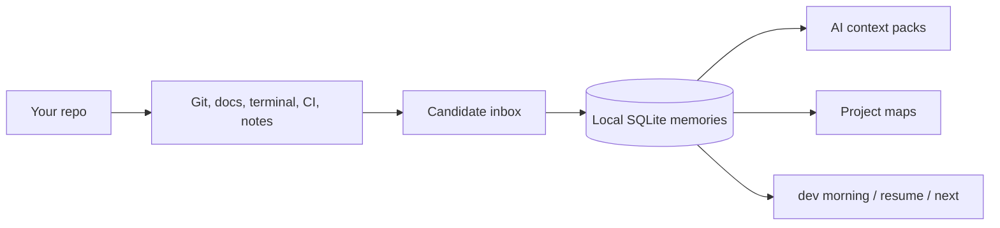
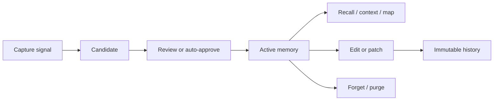
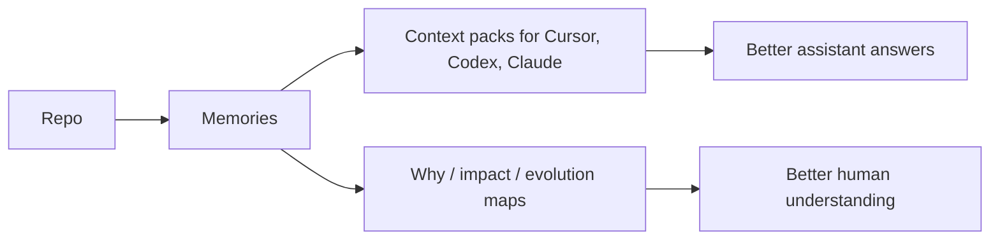

# memory.cpp

> memory.cpp helps your repo remember what happened, why it changed, and what to do next.

**Tagline:** local-first engineering memory for developers and AI coding assistants.

`memory.cpp` is a small local memory layer for software projects. It stores useful project facts, decisions, fixes, commands, and timelines in a SQLite database under your repo, then turns that memory into daily summaries, context packs, and project maps.

It is not a hosted AI memory service. It is not a vector database you have to design around. It is a developer tool that makes a repo easier to resume, explain, and hand to an assistant.

## Who is this for?

- Developers who switch context often and want `memory dev resume` to rebuild the thread.
- Maintainers who want a repo to explain why things changed, not only what changed.
- AI-coding users who want Cursor, Codex, Claude, or local models to receive accurate project context.
- Solo developers who want daily project memory without a team platform or cloud account.
- Teams that want local-first decision, fix, and onboarding notes before adopting heavier systems.

## Why not just ChatGPT memory?

ChatGPT memory is about a person. `memory.cpp` is about a repo.

Your repo needs source paths, commits, commands, decisions, bug fixes, TODOs, test failures, and citations. Those belong next to the code, not inside one chat account. `memory.cpp` keeps that memory local and exports it as CLI output, maps, docs, and AI context packs.

## Why not Git history?

Git remembers diffs. `memory.cpp` remembers meaning.

Git can tell you that `src/parser.rs` changed. `memory.cpp` tries to remember why the parser workaround exists, which command reproduced the failure, which decision approved it, and what to do next.

## Why not a vector DB?

A vector DB stores embeddings. `memory.cpp` stores engineering memory.

It includes workspace scope, memory kind, tags, provenance, confidence, version history, candidate review, maps, and developer workflows. Embeddings are one retrieval tool inside the product, not the product itself.

## What does it store?

Stable local schema, small durable core:

- Project decisions and rationale.
- Bug fixes and error-to-fix notes.
- Developer workflow notes and commands.
- TODOs, roadmap notes, and next steps.
- Git-derived summaries and candidate memories.
- Terminal command history when you opt in.
- CI failure notes when you import logs.
- AI context packs and map citations generated from local memory.

## What does it never store by default?

- Secrets intentionally blocked by `.memoryignore` or redaction rules.
- Private keys, API tokens, cookies, and bearer tokens when detected.
- Terminal commands unless terminal memory is explicitly enabled.
- Direct MCP writes unless you start MCP with write access.
- Cloud copies. There is no hosted service in the core tool.

## How does it stay local?

- The default database is `.memory.cpp/memory.db`.
- Config lives beside it in `.memory.cpp/memory-config.json`.
- Runtime logs stay under `.memory.cpp/runtime/`.
- MCP audit receipts stay under `.memory.cpp/audit/`.
- The default hash and fastembed-style providers run locally.
- Ollama and OpenAI-compatible providers are explicit choices.

## How do I delete everything?

```bash
memory where
memory privacy purge --yes
```

Or remove the local folder yourself:

```bash
rm -rf .memory.cpp
```

PowerShell:

```powershell
Remove-Item -Recurse -Force .memory.cpp
```

## What is safe by default?

- Local-first storage.
- Read-only MCP by default.
- Secret redaction before MCP recall.
- Candidate inbox for uncertain memory.
- `.memoryignore` support.
- No shell execution from MCP.
- No cloud upload required.

## What is stable, beta, or experimental?

| Area | Maturity | Notes |
| --- | --- | --- |
| SQLite storage | stable | Durable local memory database. |
| Workspaces | stable | Project-scoped memory with global recall support. |
| Remember/search/explain | stable | Core memory loop. |
| Edit/restore/history | stable | Immutable version history. |
| `memory dev morning/resume/next` | beta | Daily workflow surface. |
| `memory map` HTML/Markdown/Mermaid | beta | Signature visualization surface. |
| Candidate inbox | beta | Review uncertain automatic memory. |
| Git ingest/summary/watch | beta | Git watch is useful but still young. |
| Terminal memory | experimental | Opt-in command recording. |
| CI memory | experimental | Lightweight log ingestion only. |
| FastEmbed/ONNX provider name | experimental | Current backend is local semantic hashing; real ONNX Runtime is later. |
| Dashboard | experimental | Local lightweight dashboard, not a heavy SPA. |

## Mental model



## Memory lifecycle



## Repo to context to maps



## Before and after memory.cpp

| Before | After |
| --- | --- |
| You search old chats for the reason. | `memory map why "SQLite storage"` explains it. |
| You forget the command that fixed a test. | `memory dev recall-error "ECONNRESET"` recalls it. |
| Your AI assistant guesses repo context. | `memory dev context --for cursor` gives grounded context. |
| Git shows what changed. | `memory dev morning` says what changed, what broke, and what to do next. |

## Quickstart

```bash
./scripts/install.sh --dry-run
memory setup --developer --yes
memory dev morning
memory context write --for cursor --output .memory.cpp/context/cursor.md
memory map --type evolution --output html --save .memory.cpp/demo/evolution.html
memory doctor
```

If you prefer the old explicit path style:

```bash
memory --db .memory.cpp/memory.db init --workspace demo
memory --db .memory.cpp/memory.db demo seed --workspace demo --path .
memory --db .memory.cpp/memory.db dev morning --workspace demo
```

## Beginner-friendly commands

| Plain command | What it means |
| --- | --- |
| `memory what` | Explain what memory.cpp is doing. |
| `memory where` | Show where local data lives. |
| `memory today` | Show what happened today. |
| `memory yesterday` | Show what happened yesterday. |
| `memory next` | Suggest the next practical action. |
| `memory welcome` | Friendly first-run overview. |
| `memory setup --developer` | Create local config and safe defaults. |
| `memory privacy status` | Show privacy and local-storage status. |
| `memory show-map` | Generate a local HTML project map. |
| `memory show-context` | Print an AI assistant context pack. |
| `memory attach cursor --dry-run` | Preview an editor integration safely. |
| `memory watch once --dry-run` | Preview automatic repo memory candidates. |

## Three killer workflows

```bash
memory dev morning
memory context write --for cursor --output .memory.cpp/context/cursor.md
memory map --type evolution --output html
```

What just happened: the first command tells you where work stands, the second builds a local AI context pack, and the third creates a shareable project evolution map.

## Integrations

Attach is safe by default and backs up config files before writing.

```bash
memory attach cursor --dry-run
memory attach claude --dry-run
memory attach vscode --dry-run
memory attach continue --dry-run
memory attach ollama --dry-run
memory attach status
```

MCP tools are read-only by default. Memory writes require explicit approval or stay disabled in generated snippets.

## Short glossary

- **Memory:** a useful project fact, decision, fix, command, or note.
- **Workspace:** a named scope, usually one repo or project.
- **Candidate:** a possible memory waiting for review.
- **Provenance:** where a memory came from: file, commit, command, chat, or import.
- **Context pack:** a clean block of repo memory for an AI assistant.
- **Map:** a visual explanation of project evolution, decisions, bugs, and impact.
- **MCP:** a local protocol that lets tools like Cursor or Claude ask memory.cpp for context.
- **Proxy:** an OpenAI-compatible local endpoint that can inject memory into model requests.
- **Embedding:** a searchable numeric representation of text. Optional, local by default.

## Documentation

Start here:

- [Quickstart](docs/quickstart.md)
- [Install](docs/install.md)
- [First five minutes](docs/first-five-minutes.md)
- [Core concepts](docs/core-concepts.md)
- [CLI reference](docs/cli.md)
- [Developer workflow](docs/dev-workflow.md)
- [AI context packs](docs/context-packs.md)
- [Integrations](docs/integrations/cursor.md)
- [Watch](docs/watch.md)
- [CI memory](docs/ci-memory.md)
- [Safety](docs/safety.md)
- [Privacy](docs/privacy.md)
- [FAQ](docs/faq.md)

The static website lives in [website/](website/). Open [website/index.html](website/index.html) locally or deploy it with the GitHub Pages workflow.

## Install from source

Unix:

```bash
./scripts/install.sh --dry-run
./scripts/install.sh
```

PowerShell:

```powershell
./scripts/install.ps1 -DryRun
./scripts/install.ps1
```

Verify:

```bash
cargo test
memory doctor
```

## Project direction

The current public developer adoption release merges the understandability, daily-habit, and trust work into one local-first developer experience.

Near-term work stays in the same lane: better install verification, richer docs examples, stronger smoke coverage, and clearer beta labels.

Deferred on purpose: fuzzing packs, mobile packs, hosted cloud sync, enterprise permissions, and plugin marketplace.
